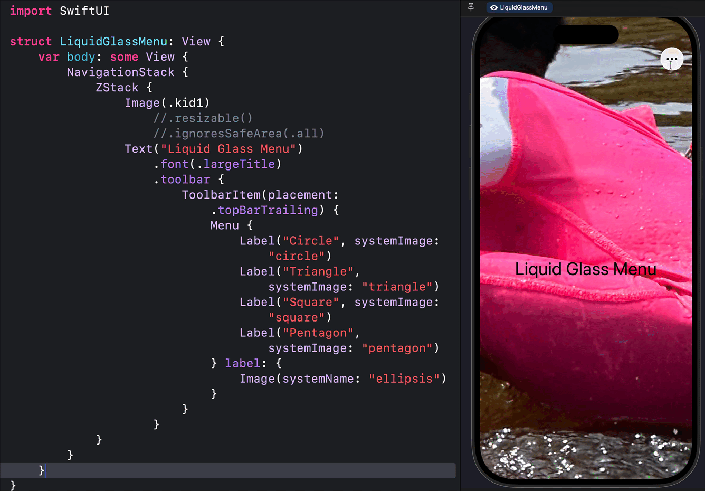

# Awesome Liquid Glass

## Fluid morphing animation/motion, inspirational designs, and use cases with SwiftUI code samples for iOS 26, watchOS 26, and macOS 26

This repo showcases the beauty of liquid glass in different SwiftUI components. I will update the repo with different Liquid Glass examples from time to time. Enjoy.

**Note**: The Liquid Glass effects are more beautiful than what you see in the GIF previews. Due to the colors in the images, the GIF previews below are not crisp. Grab the SwiftUI files and try them with your images. 

## Liquid Glass Tab Bar (Squash, stretch, and jello-like effect): [LiquidGlassTabBar.swift](https://github.com/GetStream/awesome-liquid-glass/blob/main/SwiftFiles/LiquidGlassTabBar.swift)

--

## Custom Glass Effect on Different Surfaces: [LiquidGlassHContainer.swift](https://github.com/GetStream/awesome-liquid-glass/blob/main/SwiftFiles/LiquidGlassHContainer.swift)

--

## Liquid Glass Slider: [LiquidGlassJello.swift](https://github.com/GetStream/awesome-liquid-glass/blob/main/SwiftFiles/LiquidGlassJello.swift)

--

## Liquid Glass Menu: [LiquidGlassMenu.swift](https://github.com/GetStream/awesome-liquid-glass/blob/main/SwiftFiles/LiquidGlassMenu.swift)

--

## Glass Overlapping: [LiquidGlassRoundedFloating.swift](https://github.com/GetStream/awesome-liquid-glass/blob/main/SwiftFiles/LiquidGlassRoundedFloating.swift)

--

## Custom Glass Floating Button: [CustomGlassEffect.swift](https://github.com/GetStream/awesome-liquid-glass/blob/main/SwiftFiles/CustomGlassEffect.swift)

--

## Glass on Swappin Views: [LiquidGlassPlayButton.swift](https://github.com/GetStream/awesome-liquid-glass/blob/main/SwiftFiles/LiquidGlassPlayButton.swift)
--

### Liquid Glass Toolbar Items: [LiquidGlassToolbarItems.swift](https://github.com/GetStream/awesome-liquid-glass/blob/main/SwiftFiles/LiquidGlassToolbarItems.swift)
--
